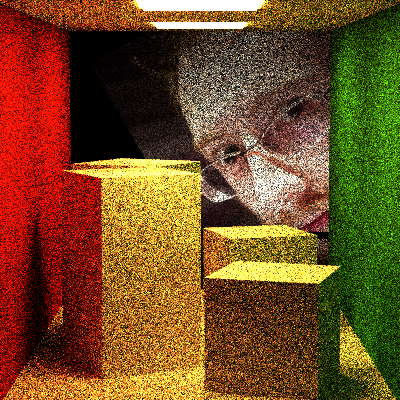
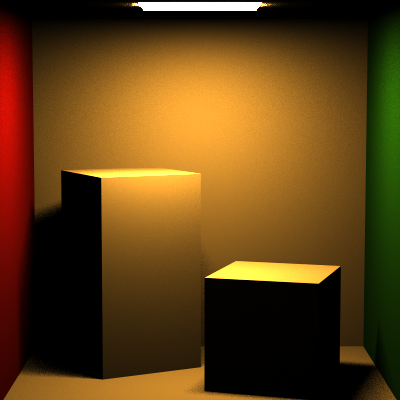
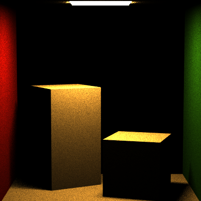

# CIS_461_HW5

## Mirror Reflection (Specular Reflection)

Well...somedays before I think I got it done(when the TBN is still wrong), now I see it is Adam's face that looks like the reflection(when in wrong places.)

## Transmit Materials (BTDF)

## Fresnel

## Direct Lighting 

