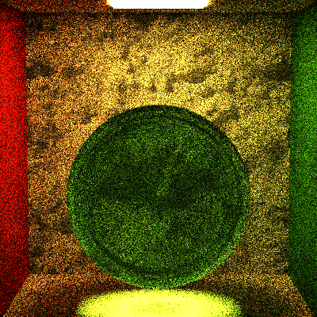
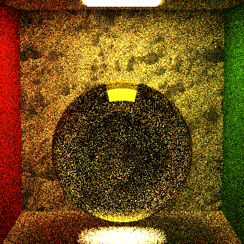

# CIS_461_HW5

## Mirror Reflection (Specular Reflection) ##

Well...somedays before I think I got it done(when the TBN is still wrong). 
Now I see it is Adam's face that looks like the reflection(when in wrong places.)

## Transmit Materials (BTDF) ##

## Fresnel ##

## Direct Lighting ##

